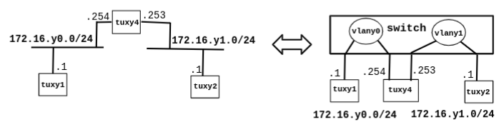

# Part 2
## Ex.3

### Steps 

1. Transform tuxy4  (linux machine) into a router 
    - Configure also tuxy4.eth1  
    - Enable IP forwarding  
    - Disable ICMP echo-ignore-broadcast 
2. Observe MAC addresses and IP addresses in tuxy4.eth0 and tuxy4.eth1 
3. Reconfigure tuxy1 and tuxy2 so that each of  them can  reach the other 
4. Observe the routes available at the 3 tuxes  (route  –n) 
5. Start capture at tuxy1 
6. From tuxy1, ping the other network interfaces (171.16.y0.254, 171.16.y1.253, 171.16.y1.1) and verify if there is connectivity. 
7. Stop capture and save logs 
8. Start capture in tuxy4; use 2 instances of Wireshark, one per network interface 
9. Clean the ARP tables in the 3 tuxes 
10. In tuxy1, ping tuxy2 for a few seconds. 
11. Stop captures in tuxy4 and save logs 

### Questions

- What routes are there in the tuxes? What are their meaning? 
- What information does an entry of the forwarding table contain?  
- What ARP messages, and associated MAC addresses, are observed and why? 
- What ICMP packets are observed and why?      - What are the IP and MAC addresses associated to ICMP packets and why?

## Configurações de Rede em Linux 
- Re-inicialização do subsistema de comunicação 
    - `/etc/init.d/networking restart` 
- Configuração tuxxy     
    - activar interface eth0 
        - `root# ifconfig eth0 up`
    - listar configurações actuais das interfaces de rede 
        - `root# ifconfig`      
    - configurar eth0 com endereço 192.168.0.1 e máscara 16 bits  
        - `root# ifconfig eth0 192.168.0.1/16`      
    - adicionar rota para subrede 
        - `root# route add -net 192.168.1.0/24 gw 172.16.4.254`
    - adicionar rota default 
        - `root# route add default gw 192.168.1.1`      
    - listar rotas actuais 
        - `root# route -n`
    - `echo 1 > /proc/sys/net/ipv4/ip_forward`
    - `echo 0 >  /proc/sys/net/ipv4/icmp_echo_ignore_broadcasts`

## Handling VLANs in Cisco Switch – Cap. 12

- Creating an Ethernet VLAN -
    - `configure terminal `
    - `vlan x0`
    - `end`
    - `show vlan id x0 `
- Deleting a vlan 
    - `configure terminal` 
    - `no vlan x0 `
    - `end `
    - `show vlan brief` 
- Add port 1 to vlan x0 
    - `configure terminal` 
    - `interface fastethernet 0/1` 
    - `switchport mode access `
    - `switchport access vlan x0` 
    - `end` 
    - `show running-config interface fastethernet 0/1 `
    - `show interfaces fastethernet 0/1 switchport `
